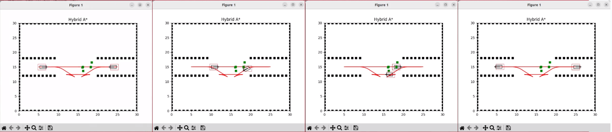

# Multi-agent-Motion-Planning-with-Improved-CBS-algorithms
This repository delves into the critical realm of multi-agent path planning of Non-holonomic Mobile robots. The objective is to design and implement ICBS (Improved Conflict-Based Search) that enables multiple agents to navigate environments, coordinating their movements seamlessly while avoiding collisions.

<!-- ABOUT THE PROJECT -->
## About The Project

This project addresses the domain of multi-agent path planning for Non-holonomic Mobile robots, specifically focusing on implementing ICBS (Improved Conflict-Based Search). The objective is to facilitate the seamless coordination of multiple agents navigating constrained spaces, ensuring operational efficiency, safety, and collision avoidance. The primary application area is pick and place operations within a warehouse, emphasizing precision, speed, and safety.

## Multi-agent path finding (MAPF): Grid based vs continuous space-based motion planning

Points           | occupancy grid algorithm           |  state lattices algorithm
:-------------------------:|:-------------------------: |:-------------------------:
Definition:   | Grids are built by the repetition of rectangles or squares to discretize a continuous space | Lattices are constructed by regularly repeating primitive paths that connect possible states for the vehicle
Representation: | In grid-based MAPF, the environment is discretized into a grid or graph, where each cell or node represents a specific location. | In continuous space-based MAPF, the environment is represented as a continuous space, allowing for a more detailed and realistic representation of the surroundings.
Movement: | Agents move from one grid cell to another, typically constrained to cardinal or diagonal directions, simulating movements in discrete steps. | Agents can move freely within the continuous space, allowing for a more natural representation of motion, without being restricted to grid cells.
Complexity: | Planning in a grid-based environment can be computationally efficient, especially for discrete and structured spaces. | Planning in continuous space introduces more complexity, as algorithms need to consider a broader range of potential trajectories and interactions. 
Applicability: | Well-suited for environments with clearly defined paths and discrete obstacles, such as indoor environments or digital environments | Well-suited for environments where movement is not restricted to discrete steps, such as outdoor spaces, and where precision and smooth trajectories are crucial.

## Methods

- To accomplish this goal, we will be employing a 2D simulation environment (replicating real-world warehouse) and implement CBS and ICBS (Improvised Conflict-Based Search) that enables multiple agents to navigate environment, while avoiding collisions.
- We have employed Hybrid A star algorithm in 2D environment to plan paths for multi agents. Hybrid A star will be acting as the low-level algorithm for ICBS.
- We have implemented the algorithm which employs prioritized conflict resolution and disjoint splitting to enhance the path planning process.

Stages: a)Agents at initial position, b) Agent 1(left) is prioritized so agent 2 changed the path, c) Agent 2 planned a parallel optimum path for goal,
d) Agents at goal position, (Green dots shown illustrate the conflict locations resolved/ avoided while planning path

## How to run the code
Code  
── BreadcrumbsMulti-agent-Motion-Planning-with-Improved-CBS-algorithms/  
   ├── Astar.py 
   ├── cbs.py 
   ├── main.py 
   ├── README.md 
   └── requirements.txt 

Requirements:
- numpy==1.20.3
- matplotlib==3.4.2
- heapdict==1.0.1
- scipy==1.7.0

run :
- python3 run main.py

## Results

Results are analyzed for two types of agents, holonomic and non-holonomic considering key points in motion planning performance check as follows:
* Path Optimality:
    
  * Paths found for holonomic agents were optimum paths for given start and goal locations after resolving conflicts.
  * Paths found for non-holonomic agents were suboptimum paths for given start and goal locations after resolving conflicts.
* Conflict resolving:
  * Paths found for holonomic as well as non-holonomic agents were without conflicts for all the cases with 100% success.
* Completeness:
  * Paths found for holonomic agents guarantee finding a solution if one exist.
  * Paths found for non-holonomic agents doesnot guarantee finding a solution.

<!-- CONTRIBUTING -->
## Contributing

Contributions are what make the open source community such an amazing place to learn, inspire, and create. Any contributions you make are **greatly appreciated**.

If you have a suggestion that would make this better, please fork the repo and create a pull request. You can also simply open an issue with the tag "enhancement".
Don't forget to give the project a star! Thanks again!

(<a href="#readme-top">back to top</a>)

